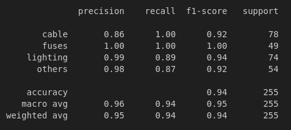

## Answering to questions:

1. Code that you wrote to solve the problem
   - Code is present in the [repository](https://github.com/ashuguptahere/parspec-assignment-2.git)

2. Inference pipeline function or hosted app link
   - Built a Gradio app to allow users to input a PDF URL, process the file, and classify it into one of the four categories with associated probabilities.

3. Answer the below questions:

   1. How long did it take to solve the problem?
       - The problem took approximately 4-5 hours to solve, including data preprocessing, text extraction from PDFs, feature engineering, model training, evaluation, and building the inference pipeline.

   2. Explain your solution:
       - Data Preparation: Downloaded the dataset and stored it locally for training and testing. Extracted text content from PDF files using PyMuPDF (fitz) and preprocessed the text to remove noise, such as stop words, special characters, and unnecessary whitespace.
       - Feature Engineering: Used TF-IDF (Term Frequency-Inverse Document Frequency) to convert the extracted text into numerical features for model training.
       - Model Training: Trained a Random Forest Classifier to classify PDFs into one of four categories: Lighting, Fuses, Cables, and Others.
       - Model Evaluation: Evaluated the model on the test dataset using precision, recall, and F1-score, which provide a holistic view of model performance, especially for imbalanced datasets.
       - Inference Pipeline: Built a Gradio app to allow users to input a PDF URL, process the file, and classify it into one of the four categories with associated probabilities.

   3. Which model did you use and why?
       - I used a Random Forest Classifier for the following reasons:
         - Robustness: Random Forest is resilient to overfitting, especially when the dataset has high-dimensional data like TF-IDF features.
         - Ease of Implementation: It works well out of the box without requiring extensive hyperparameter tuning.
         - Interpretability: Feature importance can be easily derived, helping to understand which words contribute most to predictions.
         - Versatility: Random Forest performs well on both structured and unstructured data, making it suitable for text classification tasks.

   4. Any shortcomings and how can we improve the performance?
      - Shortcomings:
        - Limited Dataset: The performance may suffer if the dataset is too small or imbalanced.
        - Feature Limitation: Using only TF-IDF may not capture the semantic meaning of the text.
      - Improvements:
          - Using Advanced NLP Models: Integrate Transformer-based models like BERT or RoBERTa for better feature representation and classification accuracy.
          - Data Augmentation: Generate synthetic training samples to address any imbalance or data scarcity.
          - Hyperparameter Tuning: Perform grid search or randomized search to optimize the model's parameters.
          - Handling Class Imbalance: Use techniques like SMOTE (Synthetic Minority Oversampling Technique) or weighted class penalties.
    5.  Report the model's performance on the test data using an appropriate metric Explain why you chose this particular metric.
        - Performance Metrics:
            - Accuracy: Measures the percentage of correct predictions but can be misleading for imbalanced datasets.
            - Precision: Indicates the proportion of true positives among predicted positives. Useful when minimizing false positives is critical.
            - Recall: Measures the proportion of true positives captured among all actual positives. Useful when minimizing false negatives is crucial.
            - F1-Score: The harmonic mean of precision and recall. It provides a balanced measure, especially in cases of class imbalance.
        - Why F1-Score?
            - The F1-score was chosen because it balances the trade-off between precision and recall, making it suitable for datasets where some classes may have fewer samples.
            - 