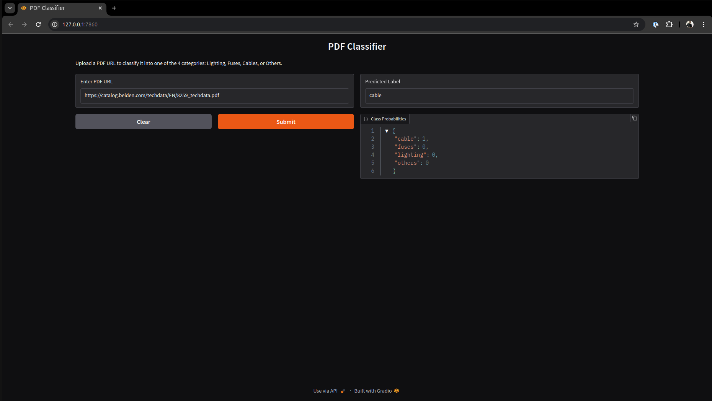

# Parspec Assignment 2 - PDF Classifier

## Huggingface live hosted website:
```
https://huggingface.co/spaces/ashuguptahere/parspec-assignment-2
```

## 📥 Installation:

### Install [uv](https://docs.astral.sh/uv/getting-started/installation/) for linux:
```
curl -LsSf https://astral.sh/uv/install.sh | sh
```

### Clone the repository:
```
git clone https://github.com/ashuguptahere/parspec-assignment-2.git
cd parspec-assignment-2
```

### Install all `uv` dependencies:
```
uv sync
```

### To download PDF file and Train model, view `preprocess_and_train.ipynb` file or type:
```
jupyter notebook preprocess_and_train.ipynb
```

### To run `gradio` app, type:
```
gradio app.py
```

## 📊 Result:



## 📝 Answers:
Answers to assignment's questions is available here [ANSWERS.md](ANSWERS.md)

## 🤝 Contributing:

Contributions are welcome! Please feel free to submit a Pull Request.

1. Fork the project
2. Create your feature branch (`git checkout -b feature/AmazingFeature`)
3. Commit your changes (`git commit -m 'Add some AmazingFeature'`)
4. Push to the branch (`git push origin feature/AmazingFeature`)
5. Open a Pull Request

## 📝 License:

This project is licensed under the MIT License - see the [LICENSE](LICENSE) file for details.

---
Made with ❤️ by [Aashish Gupta](https://github.com/ashuguptahere)